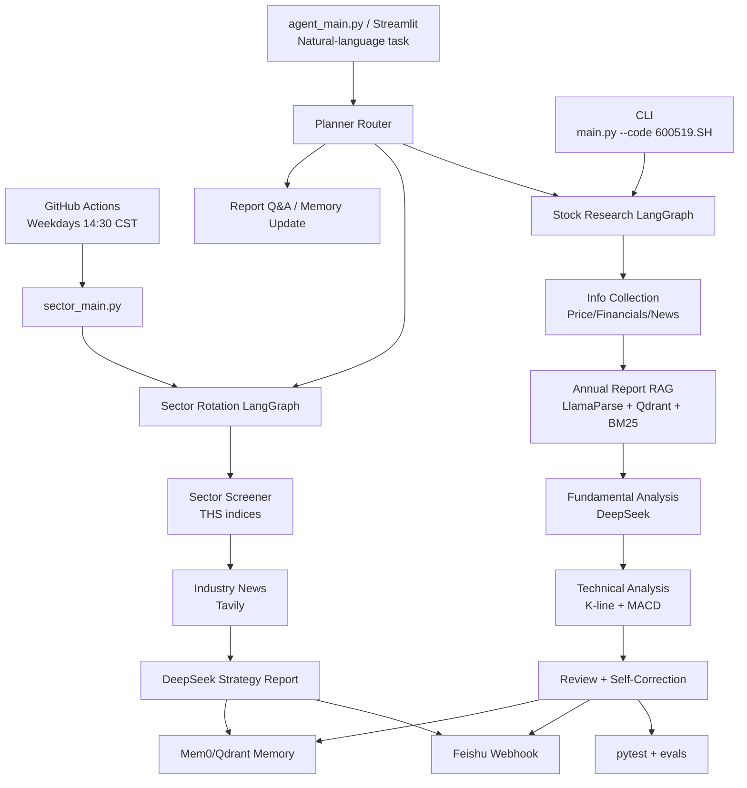

# BIGA — A-Share Multi-Agent Financial Research System

> Automatically analyzes A-share sector rotation every trading day at 2:30 PM and pushes a structured report to Feishu (Lark). Built with LangGraph multi-agent workflow, powered by real TongHuaSun (THS) official sector indices.

[中文文档](README_CN.md)

---

## What It Does

- **Sector Rotation Analysis**: Covers 22 major industries (semiconductor, food & beverage, banking, new energy, etc.), each mapped to multiple THS official sub-indices for accuracy
- **Planner Router**: Accepts natural-language tasks and routes them to stock research, sector rotation, report RAG Q&A, or memory update
- **AI-Generated Report**: DeepSeek LLM analyzes the data and writes a ~400-word strategy report — top gainers, top losers, rotation logic, and personalized suggestions based on your holdings
- **Auto Push to Feishu**: Sends a rich-text card to your Feishu group every weekday at 14:30 CST (via GitHub Actions — no server, no Mac required)
- **Individual Stock Research**: Deep-dive report for any A-share stock (financials + news + K-line chart + self-correction review)
- **Annual Report RAG**: Put annual/quarterly report PDFs under `data/reports/company_name/`; the stock workflow retrieves relevant passages with LlamaParse + vector search + BM25
- **Structured Review & Evals**: Critic agent returns JSON checks for consistency, risks, and citations; lightweight eval scripts support report regression checks
- **Personalized Memory**: Mem0 long-term memory remembers your portfolio and past judgments, making each report progressively more relevant to you

---

## Architecture



```
GitHub Actions (14:30 CST, Mon–Fri)
        ↓
sector_main.py
        ↓
┌─────────────────────────────────────┐
│         LangGraph Workflow          │
│                                     │
│  screener_node                      │
│  → Pull 22 sectors from THS API    │
│  → Read user memory (Mem0)         │
│                                     │
│  researcher_node                    │
│  → THS sector index history        │
│  → Tavily news search              │
│  → DeepSeek analysis per sector    │
│                                     │
│  reporter_node                      │
│  → Compile rotation report         │
│  → Save to Mem0 memory             │
│  → Push Feishu rich-text card      │
└─────────────────────────────────────┘
```

**Tech Stack**

| Component | Technology |
|-----------|-----------|
| Agent Framework | LangGraph + LangChain |
| LLM | DeepSeek V4 (via DMXAPI) |
| Sector Data | AKShare → TongHuaSun Official Indices |
| News Search | Tavily Search API |
| Long-term Memory | Mem0 Cloud (set MEM0_API_KEY) / Local Qdrant (no Docker) |
| Notification | Feishu Custom Bot Webhook |
| Automation | GitHub Actions (free, cloud-based) |
| PDF Parsing | LlamaParse (for annual report RAG) |
| Testing & Eval | pytest + GitHub Actions CI + evals |
| Demo UI | Streamlit |

---

## Quick Start

### 1. Clone & Install

```bash
git clone https://github.com/yunxuanQu999/BIGA-financial-research-agent.git
cd BIGA-financial-research-agent
python -m venv venv && source venv/bin/activate
pip install -r requirements.txt
```

### 2. Configure Keys

```bash
cp .env.example .env
# Edit .env and fill in your keys
```

Required keys:

| Key | Where to Get |
|-----|-------------|
| `DEEPSEEK_API_KEY` | [dmxapi.cn](https://dmxapi.cn) or [platform.deepseek.com](https://platform.deepseek.com) |
| `TAVILY_API_KEY` | [tavily.com](https://tavily.com) — free 1,000 requests/month |
| `FEISHU_WEBHOOK_URL` | Feishu group → Settings → Bots → Add Bot → Custom Bot → Copy URL |
| `MEM0_API_KEY` (optional) | [app.mem0.ai](https://app.mem0.ai) — enables cloud-persistent memory across devices |

### 3. Run

```bash
# Daily sector rotation analysis
python sector_main.py --period 日

# Weekly
python sector_main.py --period 周

# Individual stock research
python main.py --code 600519.SH --user my_user --name 贵州茅台

# Unified Agent entrypoint
python agent_main.py "分析 600519.SH" --user my_user --name 贵州茅台
python agent_main.py "今日哪些板块强？"
python agent_main.py "记住我持有半导体ETF，风险偏好中等"

# Streamlit demo
streamlit run streamlit_app.py
```

### Annual Report RAG

Place PDFs in a company-specific folder:

```bash
mkdir -p data/reports/贵州茅台
# Put annual/quarterly report PDFs under data/reports/贵州茅台/
python main.py --code 600519.SH --user my_user --name 贵州茅台
```

If `LLAMA_CLOUD_API_KEY` or PDFs are missing, the workflow skips report retrieval and continues with structured financial indicators.

### Tests

```bash
pytest
```

The current tests cover stock-code normalization, sector return averaging, RAG fallback behavior, and stock workflow nodes.

### Lightweight Evals

```bash
python evals/run_eval.py --report output/sample_report.md
```

The evaluator checks report structure, risk warnings, keyword coverage, and report citations.

---

## GitHub Actions Auto-Schedule

The workflow runs automatically every weekday at **14:30 CST** (06:30 UTC) without any server or Mac.

To enable:
1. Fork this repo
2. Go to **Settings → Secrets and variables → Actions**
3. Add these secrets: `DEEPSEEK_API_KEY`, `DEEPSEEK_BASE_URL`, `DEEPSEEK_MODEL`, `TAVILY_API_KEY`, `FEISHU_WEBHOOK_URL`, `MEM0_API_KEY` (optional)
4. Go to **Actions** tab → **A股板块轮动日报** → **Run workflow** to test manually

**GitHub Actions run page guide:**

```text
Actions
├── Tests
│   └── runs pytest on push / pull_request
└── A股板块轮动日报
    ├── schedule: weekdays 06:30 UTC / 14:30 CST
    ├── workflow_dispatch: manual trigger from GitHub UI
    └── sector-analysis
        ├── checkout
        ├── setup-python 3.11
        ├── pip install -r requirements.txt
        └── python sector_main.py --period 日 --user default_user
```

After a successful run, your Feishu group receives a rich-text card with top sectors, weak sectors, and the strategy report. If a run fails, inspect the `sector-analysis` log for dependency, data-source, or API-key errors.

---

## Sample Output

```text
============================================================
  A-share Sector Rotation Analysis — Daily
============================================================

Top sectors
Semiconductor +2.31% | Driven by AI compute demand and domestic substitution.
Communication +1.84% | Optical module and carrier capex expectations improved.
New Energy +1.22% | Battery material prices stabilized, leaders rebounded.

Weak sectors
Real Estate -1.05% | Sales data remains weak after policy expectation digestion.
Banking -0.62% | Net interest margin pressure remains, defensive funds rotated out.

Strategy report
The market shows structural rotation, with risk appetite recovering in growth sectors.
Watch semiconductor and communication names with clear industry catalysts, while staying
cautious on property-chain names without confirmed fundamental recovery.

This AI-generated report is for reference only and is not investment advice.
```

---

## Personalized Memory

Tell the system about your portfolio so it gives you relevant suggestions:

```bash
python -c "
from memory.long_term import remember_user_preference
remember_user_preference('my_user', '我持有半导体ETF，关注新能源板块，风险偏好中等')
"
```

From the next run, the report will include a section tailored to your holdings.

---

## Project Structure

```
├── sector_main.py          # Entry: sector rotation analysis
├── main.py                 # Entry: individual stock research
├── agent_main.py           # Unified Planner/Router entrypoint
├── streamlit_app.py        # Streamlit demo UI
├── workflow/
│   ├── sector_graph.py     # LangGraph: 3-node sector workflow
│   ├── graph.py            # LangGraph: stock research workflow with RAG + self-correction
│   └── router.py           # Planner Router
├── tools/
│   ├── sector_data.py      # THS sector index data
│   ├── stock_data.py       # AKShare stock price & financials
│   ├── web_search.py       # Tavily news search
│   ├── python_sandbox.py   # K-line chart generation
│   └── feishu_webhook.py   # Feishu push
├── memory/
│   └── long_term.py        # Mem0 + Qdrant memory
├── rag/
│   ├── loader.py           # LlamaParse PDF parsing
│   ├── hybrid_search.py    # Vector + BM25 hybrid retrieval
│   ├── report_retriever.py # Annual report retrieval entrypoint
│   └── hyde.py             # HyDE query enhancement
├── tests/                  # pytest unit tests
├── evals/                  # lightweight evaluation cases and scorer
├── .github/workflows/
│   ├── daily_sector.yml    # GitHub Actions schedule
│   └── test.yml            # pytest CI
└── .env.example            # Key template
```

---

## Key Engineering Decisions

- **THS Official Indices**: Each broad sector averages multiple THS sub-indices (e.g., "Food & Beverage" = 白酒 + 饮料制造 + 食品加工制造) for more accurate representation
- **macOS Proxy Bypass**: Monkey-patches `requests.Session.send` to force direct connection to Chinese financial domains, bypassing system-level proxies
- **LLM Timeout Guard**: `timeout=90, max_retries=1` prevents the workflow from hanging for hours when the LLM API is unresponsive
- **Planner Router**: Natural-language requests are routed to stock research, sector rotation, report Q&A, or memory updates
- **Fail-Soft Report RAG**: Missing PDFs or LlamaParse keys do not block stock research; the workflow falls back to structured financial indicators
- **Cited Report RAG**: Retrieved passages keep source file and page/block identifiers for `[1]`-style report grounding
- **Structured Self-Correction**: The critic agent uses JSON checks for data consistency, conclusion consistency, risk warnings, and citations before triggering rewrites

---

## License

MIT
