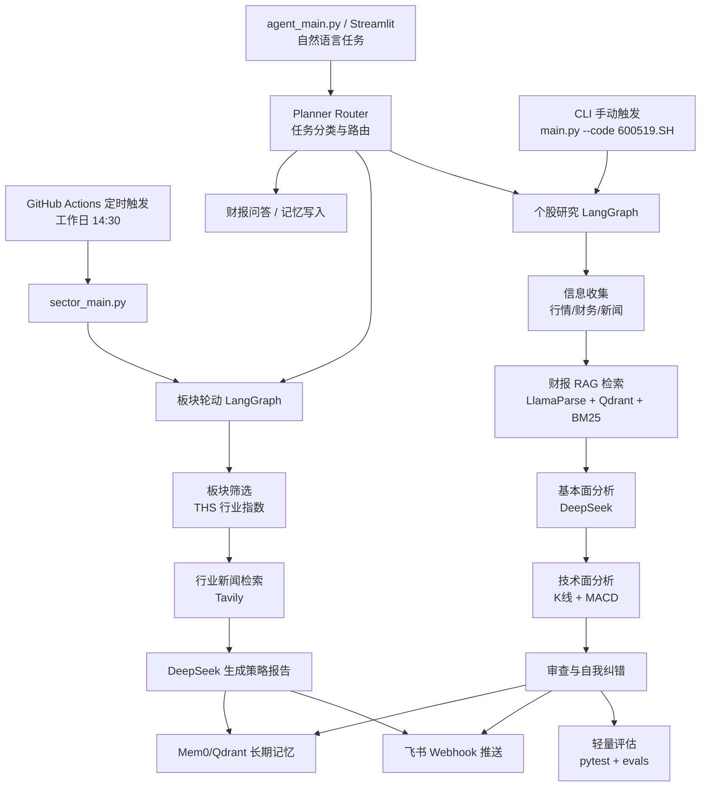

# BIGA — A股多智能体投研与决策辅助系统

> 每个交易日 14:30 自动分析 A 股行业板块轮动，生成策略报告并推送到飞书。基于 LangGraph 多智能体工作流，使用同花顺官方行业板块指数作为数据源。

[English Documentation](README.md)

---

## 系统功能

- **行业板块轮动分析**：覆盖 22 个主要行业（半导体、食品饮料、银行、新能源等），每个大板块对应多个同花顺官方子板块指数取均值，数据与同花顺 App 一致
- **Planner Router 总入口**：支持自然语言输入，自动路由到个股研究、板块轮动、财报问答或记忆写入任务
- **AI 策略报告**：DeepSeek 大模型自动撰写约 400 字的板块轮动策略报告，包含强势板块驱动逻辑、弱势板块压制因素、轮动建议，并结合你的个人持仓给出个性化分析
- **自动推送飞书**：通过 GitHub Actions 每个工作日 14:30（A 股收盘前 30 分钟）推送富文本卡片，Mac 开不开机都不影响
- **个股深度研究**：输入任意 A 股代码，生成包含财务分析、最新新闻、K 线图（含 MACD）的完整研究报告，内置自我纠错机制
- **财报 RAG 检索**：将年报/季报 PDF 放入 `data/reports/公司名/` 后，系统会通过 LlamaParse 解析，并用向量检索 + BM25 混合检索为基本面分析提供财报原文依据
- **结构化审查与评估**：Critic Agent 以 JSON 输出数据一致性、结论一致性、风险提示和引用检查，并提供轻量 eval 脚本
- **个性化长期记忆**：Mem0 记忆系统记住你的持仓、风险偏好和历史判断，让每份报告越来越贴合你的实际需求

---

## 系统架构



```
GitHub Actions（每个工作日 14:30 自动触发）
        ↓
sector_main.py
        ↓
┌─────────────────────────────────────────┐
│           LangGraph 工作流              │
│                                         │
│  screener_node（板块筛选）              │
│  → 拉取 22 个板块同花顺指数数据        │
│  → 读取用户历史记忆（Mem0）            │
│                                         │
│  researcher_node（板块分析）            │
│  → 获取各板块指数近期走势              │
│  → Tavily 搜索最新行业新闻             │
│  → DeepSeek 逐板块生成分析             │
│                                         │
│  reporter_node（汇总报告）              │
│  → 合并生成板块轮动策略报告            │
│  → 将本次分析结果写入 Mem0 记忆        │
│  → 推送飞书富文本卡片                  │
└─────────────────────────────────────────┘
```

**技术栈**

| 模块 | 技术 |
|------|------|
| 智能体框架 | LangGraph + LangChain |
| 大语言模型 | DeepSeek V4（通过 DMXAPI 调用）|
| 板块数据 | AKShare → 同花顺官方行业板块指数 |
| 新闻搜索 | Tavily Search API |
| 长期记忆 | Mem0 云端（设置 MEM0_API_KEY）/ 本地 Qdrant（无需 Docker）|
| 消息推送 | 飞书自定义机器人 Webhook |
| 自动调度 | GitHub Actions（免费，云端运行）|
| PDF 解析 | LlamaParse（用于财报 RAG）|
| 测试与评估 | pytest + GitHub Actions CI + evals |
| Demo UI | Streamlit |

---

## 快速开始

### 第一步：安装

```bash
git clone https://github.com/yunxuanQu999/BIGA-financial-research-agent.git
cd BIGA-financial-research-agent
python -m venv venv && source venv/bin/activate
pip install -r requirements.txt
```

### 第二步：配置 Key

```bash
cp .env.example .env
# 用文本编辑器打开 .env，填入你的 Key
```

必填的三个 Key：

| Key | 获取方式 |
|-----|---------|
| `DEEPSEEK_API_KEY` | [dmxapi.cn](https://dmxapi.cn) 注册后在控制台生成 |
| `TAVILY_API_KEY` | [tavily.com](https://tavily.com) 注册，免费每月 1000 次 |
| `FEISHU_WEBHOOK_URL` | 飞书群 → 群设置 → 机器人 → 添加机器人 → 自定义机器人 → 复制 Webhook 地址 |
| `MEM0_API_KEY`（可选）| [app.mem0.ai](https://app.mem0.ai) 注册，设置后记忆跨设备/云端持久化 |

### 第三步：运行

```bash
# 今日板块轮动分析（推送到飞书）
python sector_main.py --period 日

# 本周板块分析
python sector_main.py --period 周

# 个股深度研究
python main.py --code 600519.SH --user 我的账号 --name 贵州茅台

# 统一 Agent 入口：自动判断任务类型
python agent_main.py "分析 600519.SH" --user 我的账号 --name 贵州茅台
python agent_main.py "今日哪些板块强？"
python agent_main.py "记住我持有半导体ETF，风险偏好中等"

# Streamlit 演示界面
streamlit run streamlit_app.py
```

### 财报 RAG 使用方式

将年报或季报 PDF 放到公司目录下：

```bash
mkdir -p data/reports/贵州茅台
# 将 PDF 放入 data/reports/贵州茅台/
python main.py --code 600519.SH --user 我的账号 --name 贵州茅台
```

如果没有配置 `LLAMA_CLOUD_API_KEY` 或没有 PDF，系统会自动跳过财报 RAG，继续使用结构化财务指标完成分析。

### 运行测试

```bash
pytest
```

当前测试覆盖股票代码转换、板块涨跌幅均值计算、财报 RAG 降级逻辑和个股 workflow 节点。

### 运行轻量评估

```bash
python evals/run_eval.py --report output/sample_report.md
```

评估脚本会检查报告结构、风险提示、关键词覆盖和财报引用等维度，适合用于 demo 后的质量回归。

---

## GitHub Actions 自动定时推送

设置完成后，每个工作日 14:30 自动运行，不需要本地电脑开机。

**设置步骤：**
1. Fork 这个仓库
2. 进入仓库 **Settings → Secrets and variables → Actions**
3. 点 **New repository secret**，依次添加：
   - `DEEPSEEK_API_KEY`
   - `DEEPSEEK_BASE_URL`（填 `https://www.dmxapi.cn/v1`）
   - `DEEPSEEK_MODEL`（填 `deepseek-v4-pro-guan`）
   - `TAVILY_API_KEY`
   - `FEISHU_WEBHOOK_URL`
   - `MEM0_API_KEY`（可选，用于云端持久化记忆）
4. 进入 **Actions** 标签 → **A股板块轮动日报** → **Run workflow** → 手动触发一次测试

**GitHub Actions 运行页面说明：**

```text
Actions
├── Tests
│   └── push / pull_request 时自动运行 pytest
└── A股板块轮动日报
    ├── schedule: 每个工作日 06:30 UTC / 北京时间 14:30
    ├── workflow_dispatch: 支持网页手动触发
    └── sector-analysis
        ├── checkout
        ├── setup-python 3.11
        ├── pip install -r requirements.txt
        └── python sector_main.py --period 日 --user default_user
```

运行成功后，飞书群会收到一张包含强势板块、弱势板块和策略报告的富文本卡片。若失败，可在 Actions 的 `sector-analysis` 日志里查看依赖安装、数据源或 API Key 错误。

---

## 示例输出

```text
============================================================
  A股行业板块轮动分析 — 今日
============================================================

今日强势板块
半导体 +2.31% | 受国产替代、AI 算力链景气度带动，资金回流明显。
通信 +1.84% | 光模块、运营商资本开支预期改善，短线情绪较强。
新能源 +1.22% | 电池材料价格企稳，部分龙头估值修复。

今日弱势板块
房地产 -1.05% | 销售数据仍偏弱，政策预期兑现后资金分歧加大。
银行 -0.62% | 净息差压力仍在，防御资金边际流出。

策略报告
市场整体呈结构性轮动特征，成长方向风险偏好回升。短期可关注半导体、
通信等有产业催化的方向，同时规避基本面修复尚不明确的地产链。

⚠️ 本报告由 AI 自动生成，仅供参考，不构成投资建议。
```

---

## 个性化记忆

告诉系统你的持仓情况，之后每次报告都会结合你的实际情况给出建议：

```bash
python -c "
from memory.long_term import remember_user_preference
remember_user_preference('我的账号', '我持有半导体ETF，同时关注新能源板块，风险偏好中等')
"
```

从下次运行起，报告会新增一节专门针对你持仓的个性化分析。

---

## 项目结构

```
├── sector_main.py          # 入口：板块轮动分析
├── main.py                 # 入口：个股深度研究
├── agent_main.py           # 统一 Planner/Router 自然语言入口
├── streamlit_app.py        # Streamlit 演示界面
├── workflow/
│   ├── sector_graph.py     # LangGraph：3节点板块分析工作流
│   ├── graph.py            # LangGraph：个股研究工作流（含财报RAG与自我纠错）
│   └── router.py           # Planner Router：任务分类与动态路由
├── tools/
│   ├── sector_data.py      # 同花顺板块指数数据获取
│   ├── stock_data.py       # 个股价格与财务数据（新浪/THS）
│   ├── web_search.py       # Tavily 新闻搜索
│   ├── python_sandbox.py   # K 线图生成（mplfinance）
│   └── feishu_webhook.py   # 飞书推送
├── memory/
│   └── long_term.py        # Mem0 + Qdrant 长期记忆
├── rag/
│   ├── loader.py           # LlamaParse PDF 财报解析
│   ├── hybrid_search.py    # 向量检索 + BM25 混合检索
│   ├── report_retriever.py # 财报检索入口，接入个股分析 workflow
│   └── hyde.py             # HyDE 假设性文档增强
├── tests/                  # pytest 单元测试
├── evals/                  # 轻量评估用例与评分脚本
├── .github/workflows/
│   ├── daily_sector.yml    # GitHub Actions 定时配置
│   └── test.yml            # pytest CI
└── .env.example            # Key 配置模板
```

---

## 主要工程亮点

- **同花顺多子板块均值**：每个大板块对应多个细分子板块（如"食品饮料"= 白酒 + 饮料制造 + 食品加工制造的均值），避免单一子板块偏差
- **macOS 代理绕过**：通过 Monkey Patch `requests.Session.send`，对国内金融数据域名强制直连，解决系统级代理拦截问题
- **LLM 超时保护**：设置 `timeout=90, max_retries=1`，防止 API 不响应时工作流无限等待
- **Planner Router**：自然语言任务会被路由到个股研究、板块分析、财报问答或记忆写入，提高 Agent 自主性
- **财报 RAG 可降级**：没有 PDF 或 LlamaParse Key 时自动跳过检索，不阻塞个股分析主链路
- **带引用的财报 RAG**：检索结果保留来源文件和页码/块号，报告可用 `[1]`、`[2]` 标注依据
- **结构化 Self-Correction**：Critic Agent 使用 JSON 检查数据一致性、结论一致性、风险提示和引用完整性，并触发重写

---

## License

MIT
